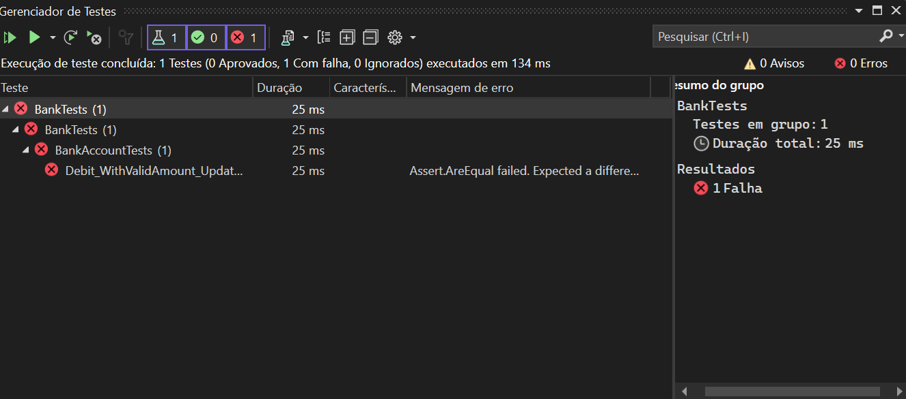
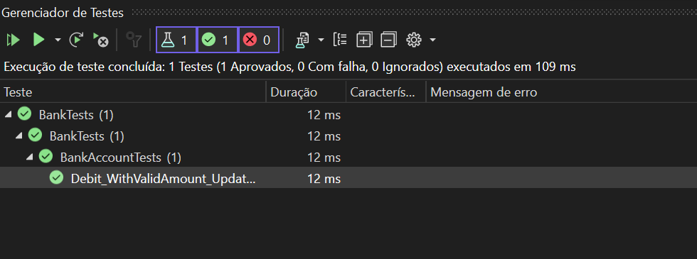
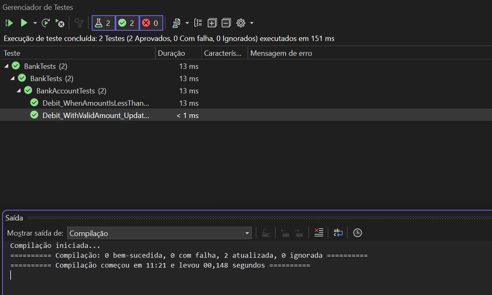
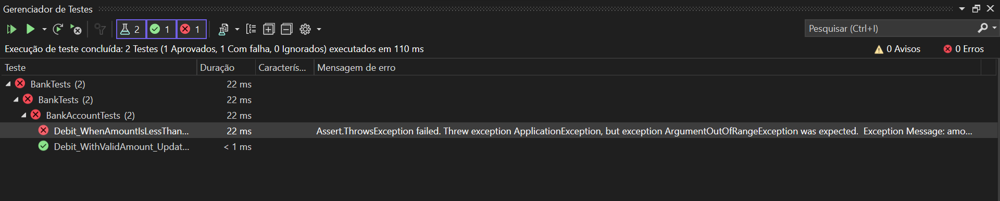
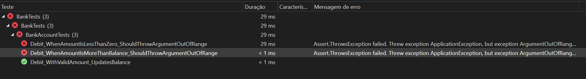

# Testes-de-unidade-para-codigo-gerenciado

## Casos testados para a função "Debit":

1. Teste com o código da função “Debit” incorreto:



Conclusão desse teste:

O resultado do teste unitário não está conforme o esperado. O teste esperava que após a operação de débito, o saldo da conta fosse de 7.44 (o saldo inicial de 11.99 menos o valor debitado de 4.55). No entanto, o saldo atual verificado após a operação de débito foi de 16.54, o que está incorreto. Isso mostra que a um erro na regra de negócio na função testada “Debit”.

2. Teste com o código da função “Debit” correto:

    
    Para corrigir a função “Debit” foi alterado “m_balance += amount; “ para “m_balance -= amount;”.
    
    Após essa mudanças o teste foi executado com sucesso:

    

    Conclusão desse teste:

    O resultado está conforme o esperado.

3. Teste para débito negativo (Falso positivo):

    Entradas: 
    
    - Define-se um saldo inicial (**`beginningBalance`**) de 11.99 para a conta bancária.
    - Define-se um valor de débito (**`debitAmount`**) de -100.00, o qual é intencionalmente inválido porque é negativo.

       

    Conclusão do teste:

    Apesar do valor de débito estar invalido o teste executou, pois, quando o método “Debit ”se comporta conforme esperado (ou seja, lança uma “ArgumentOutOfRangeException” ao receber um valor negativo), o teste é considerado bem-sucedido porque o resultado observado corresponde ao resultado esperado definido pelo teste.

    Aprendizado:

    Com esse caso de teste aprendi o correto uso da método “ArgumentOutOfRangeException”. Além disso, conclui que não basta fazer apenas testes para passar, ou seja, para que um sistema seja testado de maneira eficiente é necessário realizar testes que devem falhar, pois, conforme o caso anterior, por mais que o teste tenha passado o sistema possui um erro na função “Debit”.

4. Teste para débito negativo (Verdadeiro negativo):
    
    Entradas: 
    
    - Define-se um saldo inicial (**`beginningBalance`**) de 11.99 para a conta bancária.
    - Define-se um valor de débito (**`debitAmount`**) de -100.00, o qual é intencionalmente inválido porque é negativo.
    
    Para corrigir o caso de teste do débito negativo deve-se alterar o método “ArgumentOutOfRangeException” para o método “**ApplicationException**” na função “Debit”. O código corrigido é:

     ``` 
     public void Debit(double amount)
        {
            if (amount > m_balance)
            {
                throw new ArgumentOutOfRangeException("amount");
            }

            if (amount < 0)
            {
                // throw new ApplicationException("amount");
                throw new ApplicationException("amount");
            }

            //m_balance += amount;     
            m_balance -= amount;    
        }
     
     ```

    

    Conclusão do teste:

    Como esperado o teste falhou após as mudanças no código.  

5. Teste para débito maior que saldo (Verdadeiro negativo):

    Para fazer esse teste foi criada a função abaixo:

    ``` 
        [TestMethod]
        public void Debit_WhenAmountIsMoreThanBalance_ShouldThrowArgumentOutOfRange()
        {
            double beginningBalance = 11.99;
            double debitAmount = 100000;
            BankAccount account = new BankAccount("Mr. Bryan Walton", beginningBalance);

            Assert.ThrowsException<System.ArgumentOutOfRangeException>(() => account.Debit(debitAmount));
        }
    ```

    Assim como no caso de teste 3 para que funcione corretamente esse teste, ou seja, para que o teste falhe, é necessário modificar a função “Debit”. O código modificado está abaixo:

    ```
    public void Debit(double amount)
        {
            if (amount > m_balance)
            {
                throw new ApplicationException("amount");
            }

            if (amount < 0)
            {
                // throw new ApplicationException("amount");
                throw new ApplicationException("amount");
            }

            //m_balance += amount;     
            m_balance -= amount;    
        }    
    ```

    

    Conclusão do teste:

    Como esperado o teste falhou após as mudanças no código.


